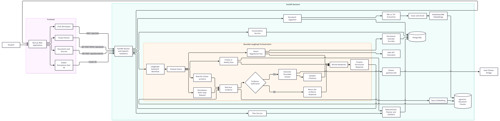

# academic-agent — College Academic Assistant


A production-structured MVP that answers from approved college documents, keeps bounded conversation context, creates and modifies validated study plans, and executes restricted calculator/calendar tools through explicit LangGraph workflows.

## Architecture and stack

Next.js 16, React, TypeScript, Tailwind CSS; FastAPI, Pydantic, SQLAlchemy, Alembic; LangChain/LangGraph; Ollama `gemma4:e2b` generation with optional Gemini/local providers; FastEmbed BGE embeddings; PostgreSQL 16 with pgvector; Docker Compose. See [architecture](docs/architecture.md).

## Prerequisites

Docker 24+ with Compose, or Node 22+ and Python 3.11–3.13 with PostgreSQL/pgvector.

## Quick start

```bash
cp .env.example .env
docker compose up --build
```

Open <http://localhost:3000>, API docs at <http://localhost:8000/docs>, and health at <http://localhost:8000/health>.

A fresh repository intentionally contains no real college policy. To make the development demo useful, ingest the clearly labelled **synthetic, non-official** corpus:

```bash
docker compose exec backend python -m scripts.ingest \
  data/demo/DEMO-academic-regulations.txt \
  data/demo/DEMO-semester-four-syllabus.txt \
  --category demo --academic-year DEMO
```

Then ask “What is the attendance requirement?” Real deployments must replace the demo with owner-approved college documents.

## Demo mode

Set `DEMO_MODE=true` for a completely deterministic presentation mode. Academic questions use predefined synthetic answers and sources, the Sources view shows only labelled demo documents, uploads are disabled, and the Planner view creates a predefined DBMS/Operating Systems plan for a new browser identity. Calculator, calendar, conversation, and plan-modification flows still execute through their real deterministic graph branches and database persistence.

Set `DEMO_MODE=false` to use uploaded approved documents, BGE retrieval, and Ollama generation. The UI displays a persistent banner whenever demo mode is active.

## Configuration

Important variables include `DATABASE_URL`, `LLM_PROVIDER`, `LLM_MODEL`, `OLLAMA_BASE_URL`, `GEMINI_API_KEY`, `EMBEDDING_PROVIDER`, `EMBEDDING_MODEL`, `RETRIEVAL_TOP_K`, `RETRIEVAL_SCORE_THRESHOLD`, `RETRIEVAL_MIN_TERM_COVERAGE`, `MULTI_STEP_MAX_SUBQUERIES`, and chunk sizes. Fresh development defaults to the existing host Ollama instance using `gemma4:e2b`, so no API credential is required. Before startup, verify `ollama list` contains that exact tag. Compose reaches the host process through a lightweight TCP bridge at `host.docker.internal:11435`; it does not install Ollama or download another model. Set `LLM_PROVIDER=gemini` and a valid key only for optional Gemini generation.

For native backend development, use `OLLAMA_BASE_URL=http://localhost:11434`; Compose uses `http://host.docker.internal:11435`.

The browser creates a stable anonymous UUID and sends it as `X-User-ID`. Conversations, plans, and mock calendar events are scoped to it. This is MVP resource isolation, not full authentication.

## Documents

Upload approved PDF/TXT files from **Sources**, or ingest files from `data/raw`. Documents are validated, cleaned, chunked, embedded, and stored in pgvector. Empty/image-only files are rejected and duplicate content updates metadata without duplicating chunks. See [RAG documentation](docs/rag.md).

## Development and tests

```bash
cd backend && pytest -q && ruff check app scripts tests
cd frontend && npm ci && npm run lint && npm run build
```

After changing `EMBEDDING_MODEL`, rebuild existing vectors before asking questions:

```bash
docker compose exec backend python -m scripts.reembed
```

Production-like vector smoke test:

```bash
docker compose exec backend python -m scripts.smoke_pgvector
```

See [setup](docs/setup.md), [API](docs/api.md), and [LangGraph workflow](docs/langgraph.md).

## Evaluation

From any checkout working directory, or inside the backend container:

```bash
cd backend && python -m scripts.evaluate
# or
docker compose exec backend python -m scripts.evaluate
```

Baseline and RAG use separate prompts and identical questions. Results and computed summary metrics are written under `evaluation/`; no superiority claim is hard-coded.

## Scope and safety

academic-agent does not invent missing college evidence. It validates citations, uses restricted deterministic tools, validates every plan, and preserves unaffected session IDs/status during modifications. Real calendar credentials, OCR, background workers, and enterprise authentication remain outside MVP scope.
